# DPGITM College Website – Day 4 Final Project

## 📌 Project Overview

This is my **Day 4 Final Project** from my Full Stack Web Development journey.

I created a college website for **DPG Institute of Technology and Management (DPGITM), Gurugram** using HTML and semantic HTML elements.

The project contains multiple sections including college information, courses, latest news, placement details, student resources, campus gallery, FAQs, contact information and footer.

## 🚀 Features

- College header with logo and introduction
- Navigation menu
- Welcome section
- Why DPGITM section
- Admission information
- About Us section
- Vision and Mission
- Courses Offered
- Latest News
- Placement Drive
- Student Corner
- Latest Announcements
- Important Links
- Upcoming Holidays
- Exam Schedule
- College Campus Gallery
- FAQ section
- Address and Google Map
- Contact Information
- Footer with social media links
- Privacy Policy and Terms & Conditions

## 🛠️ Technologies Used

- HTML5
- Semantic HTML
- Basic HTML attributes
- External links
- Google Maps iframe

## 📚 What I Learned

- Using semantic HTML elements such as:
  - `<header>`
  - `<nav>`
  - `<main>`
  - `<section>`
  - `<article>`
  - `<aside>`
  - `<figure>`
  - `<figcaption>`
  - `<footer>`
- Creating internal navigation using IDs
- Adding images and external links
- Embedding Google Maps
- Creating FAQ sections using `<details>` and `<summary>`
- Structuring a complete webpage using HTML

## 🖥️ Project Output

### Home & Welcome
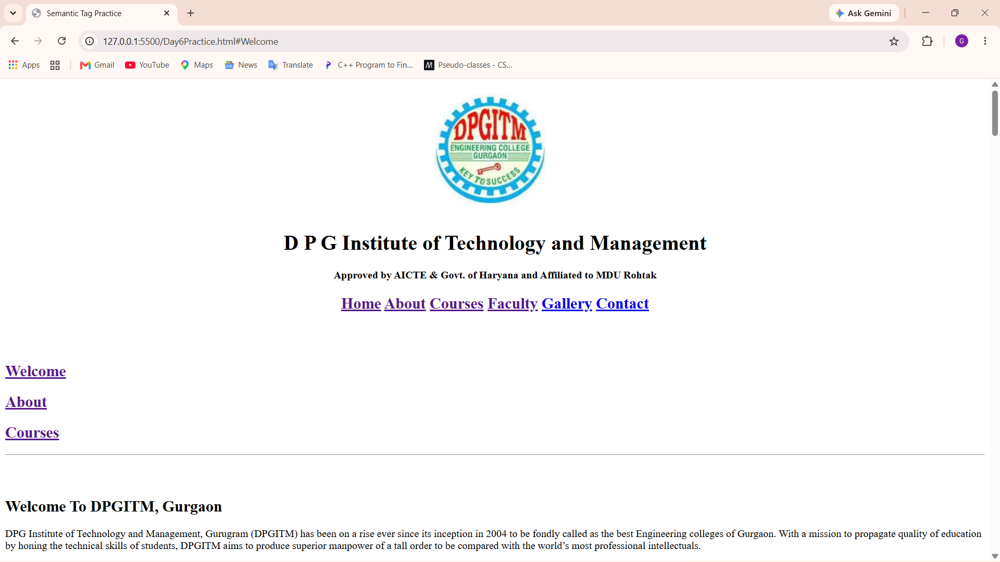

### Why DPGITM & Admission
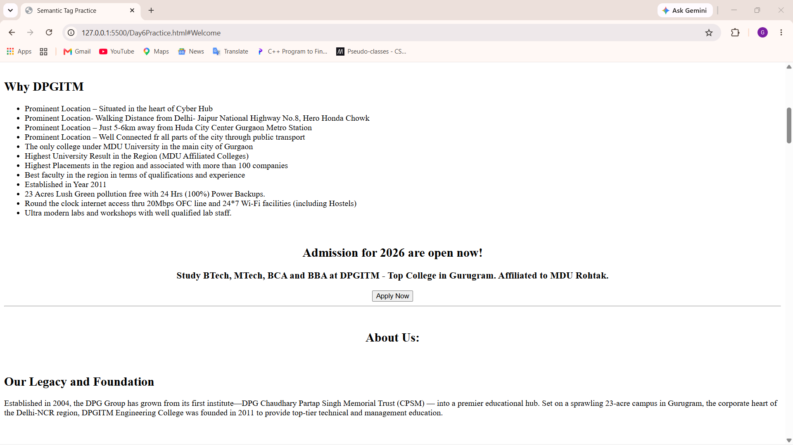

### About Us, Vision & Mission
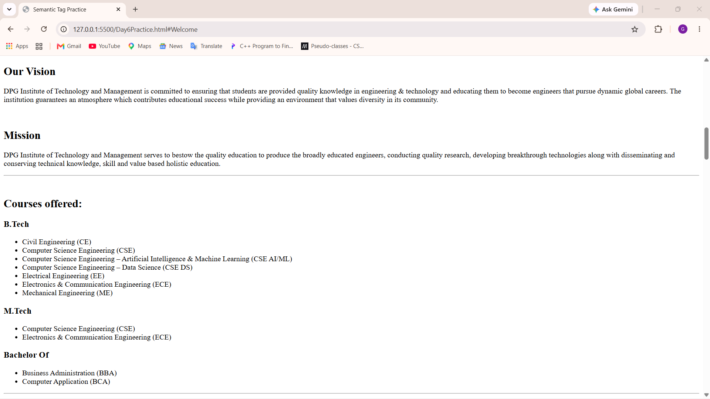

### Courses Offered
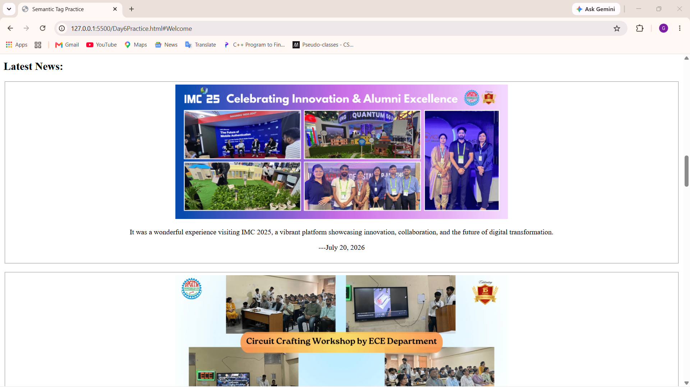

### Latest News
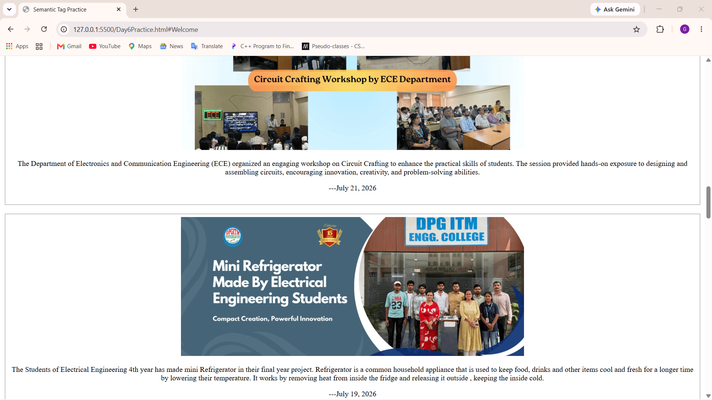

### News & Final Year Project Section
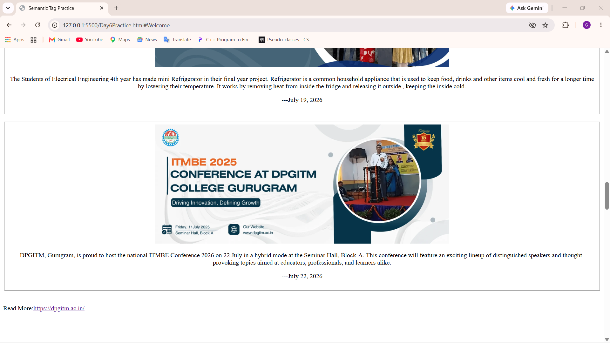

### Placement Drive
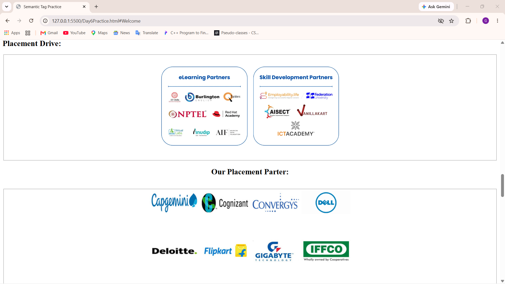

### Student Corner
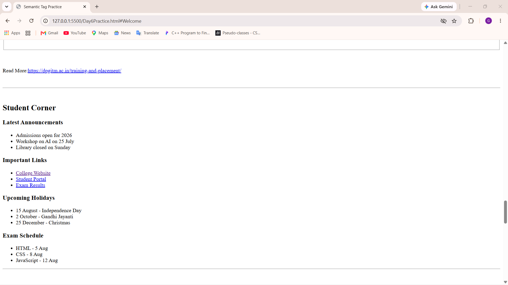

### College Campus Gallery
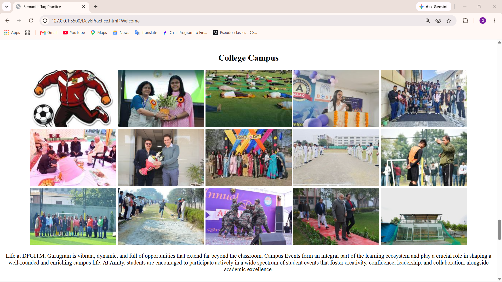

### FAQs & Address
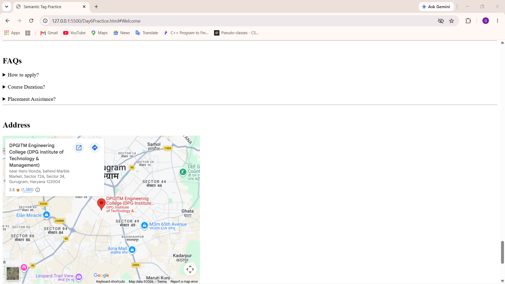

### Contact & Footer
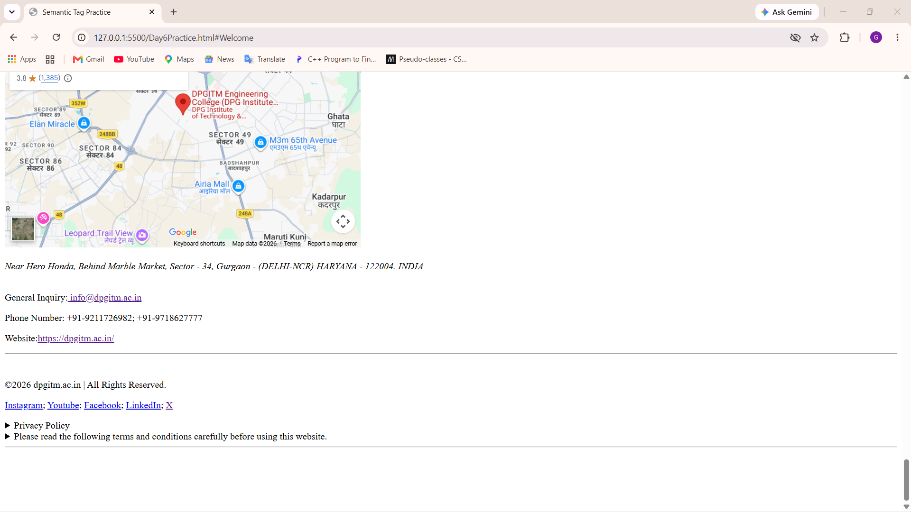

## 📁 Project Structure

```text
DPGITM-College-Website/
│
├── Day6Practice.html
├── College logo.png
├── output1.png
├── output2.png
├── output3.png
├── output4.png
├── output5.png
├── output6.png
├── output7.png
├── output8.png
├── output9.png
├── output10.png
├── output11.png
└── README.md
